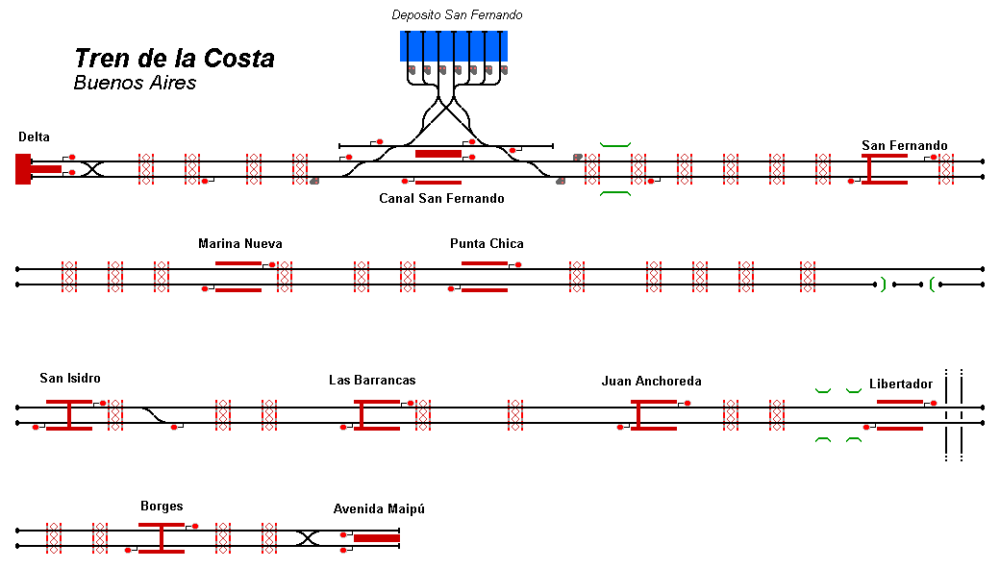

# Tren de la Costa, Buenos Aires 
Representation of the 9.6 mile rail line in greater Buenos Aires, Argentina, South America.

## Current Status

| Stage         | Status        |
| ------------- |:-------------:|
| Track Plan     | :heavy_check_mark: |
| Signalling      | :heavy_check_mark:      |
| Naming | :heavy_check_mark:      |
| Speed Limits | :heavy_check_mark: |
| Distances | :heavy_check_mark: |
| Timetable | :x: |
| Documentation | :x: |

## Data Sources

- ["Tren de la costa día lluvioso!!! Salida estación Delta" by Juan Carlos Pereyra de Armas, Youtube ](https://www.youtube.com/watch?v=7roQsPITZ4Y)
- [Map Meurisse](https://map.meurisse.org/)
